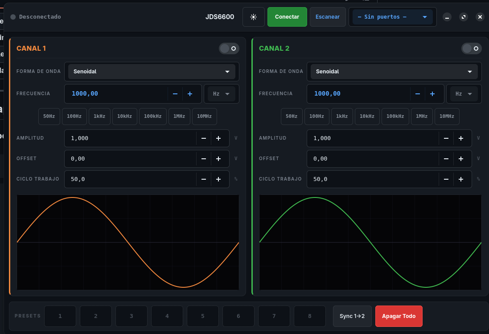
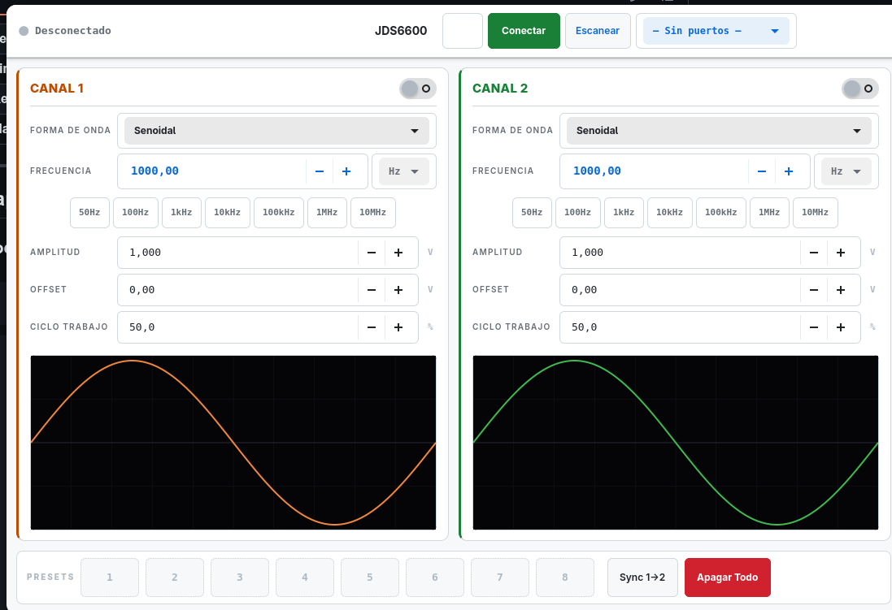

<div align="center">


# JDS6600 GTK

### Control de instrumentación de laboratorio en Rust + GTK4

[](https://www.gtk.org/)
[](https://www.rust-lang.org/)
[](https://github.com/Diez111/jds6600-gtk/releases)
[](LICENSE)
[](https://www.linux.org/)

Aplicación de escritorio nativa para controlar generadores de señales **JDS6600** y compatibles vía USB.

[Instalación](#instalación) · [Características](#características) · [Capturas](#capturas-de-pantalla) · [Uso](#uso)

</div>

---

## Características

- **Auto-detección** plug & play del JDS6600 entre puertos seriales
- **Modo claro/oscuro** con toggle en tiempo real
- **2 canales independientes** (CH1/CH2) con 17 formas de onda
- **Entrada de frecuencia** con unidades Hz/kHz/MHz y presets rápidos
- **Vista de osciloscopio** con grilla tipo instrumento
- **8 presets** guardables en `presets.json`
- **Polling 500ms** para sincronización en tiempo real
- **Empaquetado .deb** con icono para GNOME

---

## Capturas de pantalla

### Modo oscuro



### Modo claro



---

## Requisitos

- **Linux** (Debian/Ubuntu, Fedora, Arch)
- **GTK4** runtime libraries
- Generador JDS6600 conectado por USB
- Usuario en grupo `dialout`: `sudo usermod -aG dialout $USER`

---

## Instalación

### Desde paquete .deb (recomendado)

```bash
wget https://github.com/Diez111/jds6600-gtk/releases/latest/download/jds6600-gtk_amd64.deb
sudo dpkg -i jds6600-gtk_amd64.deb
jds6600-gtk
```

### Desde código fuente

```bash
git clone https://github.com/Diez111/jds6600-gtk.git
cd jds6600-gtk
cargo build --release
./target/release/jds6600-gtk
```

### Construir el .deb localmente

```bash
cargo build --release
./build-deb.sh
sudo dpkg -i jds6600-gtk_*.deb
```

### Desinstalar

```bash
sudo dpkg -r jds6600-gtk
```

---

## Uso

1. Conectar el generador por USB
2. Lanzar la app (`jds6600-gtk`)
3. Tocar **"Escanear"** — detecta automáticamente el JDS6600
4. Tocar **"Conectar"** — verifica la comunicación
5. Configurar canales: forma de onda, frecuencia, amplitud, offset, duty cycle
6. Presets rápidos: 50Hz, 1kHz, 10MHz, etc.
7. Guardar presets: botones 1-8 (click = guardar/cargar, click derecho = borrar)
8. **Sync 1→2**: copia Canal 1 al Canal 2
9. **Apagar Todo**: desactiva ambos canales
10. Cambiar tema: botón ☀/☾

---

## Protocolo serial

- **115200 baud, 8N1**
- Comandos: `:rREG=0.\n` (leer), `:wREG=VAL.\n` (escribir)
- Registros r20-r30: estado, forma de onda, frecuencia, amplitud, offset, duty cycle

## Limitaciones

- **Modulación entre canales**: no soportada por protocolo serial
- **Frecuencia**: 0.01 Hz - 60 MHz (versión lite: 15 MHz)
- **Duty cycle**: solo aplica a square, pulse, triangle, CMOS

## Solución de problemas

```bash
# Verificar dispositivo USB
lsusb | grep -i "serial\|CH34\|FTDI"

# Verificar puerto
ls -la /dev/ttyUSB*

# Verificar driver
lsmod | grep ch341
```

---

## Changelog

### v0.2.5 — Corrección de APP_ID
- APP_ID corregido para coincidir con el icono

### v0.2.4 — Icono mejorado
- Fondo más oscuro, grid de osciloscopio agregado

### v0.2.0 — Rediseño profesional
- `GtkHeaderBar` nativo, modo claro/oscuro
- 8 presets con persistencia JSON
- Auto-detección mejorada

### v0.1.0 — Versión inicial
- Control básico de JDS6600 via serial USB
- 2 canales, 17 formas de onda, presets

---

## Créditos

- **Protocolo JDS6600**: [Joy-IT](https://joy-it.net/de/products/JT-JDS6600) y [WimDH/JDS6600](https://github.com/WimDH/JDS6600)
- **Desarrollo**: [Diez111](https://github.com/Diez111)

## Licencia

MIT License — ver archivo [LICENSE](LICENSE) para detalles.
