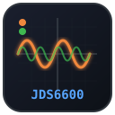

<div align="center">



# JDS6600 GTK — Generador de Señales Profesional

### Control de instrumentación de laboratorio en Rust + GTK4

[](https://www.gtk.org/)
[](https://www.rust-lang.org/)
[](https://github.com/Diez111/jds6600-gtk/releases)
[](LICENSE)
[](https://www.linux.org/)

Aplicación de escritorio nativa para controlar generadores de señales **JDS6600** y compatibles a través de puerto serial USB. Interfaz profesional de laboratorio con modo claro/oscuro, auto-detección plug & play, y visualización en tiempo real de formas de onda.

[Instalación](#instalación) · [Características](#características) · [Arquitectura](#arquitectura) · [Capturas](#capturas-de-pantalla) · [Changelog](#changelog)

</div>

---

## Índice

- [Características](#características)
- [Capturas de pantalla](#capturas-de-pantalla)
- [Requisitos](#requisitos)
- [Instalación](#instalación)
- [Uso](#uso)
- [Arquitectura](#arquitectura)
- [Protocolo serial JDS6600](#protocolo-serial-jds6600)
- [Limitaciones](#limitaciones)
- [Estructura del proyecto](#estructura-del-proyecto)
- [Desarrollo](#desarrollo)
- [Changelog](#changelog)
- [Licencia](#licencia)

---

## Características

### Interfaz de usuario

| Característica | Descripción |
|---|---|
| **GTK4 nativo** | `GtkHeaderBar` con decoraciones del sistema operativo |
| **Modo claro/oscuro** | Toggle en tiempo real, sin reiniciar la aplicación |
| **Layout responsivo** | `GtkGrid` alineado, nada desborda |
| **Paneles CH1/CH2** | Dos canales independientes con colores distintivos |
| **Vista osciloscopio** | Grilla tipo instrumento renderizada con Cairo |
| **Toast notifications** | Notificaciones flotantes sobre `GtkOverlay` |
| **Switches nativos** | Encendido/apagado de canales con `GtkSwitch` |
| **Entrada de frecuencia** | `SpinButton` con unidades seleccionables (Hz/kHz/MHz) |
| **Presets rápidos** | 50Hz, 100Hz, 1kHz, 10kHz, 100kHz, 1MHz, 10MHz |
| **Duty cycle inteligente** | Se deshabilita para formas de onda que no lo usan |

### Funcionalidad

| Característica | Descripción |
|---|---|
| **Auto-detección** | Plug & play del JDS6600 entre múltiples puertos seriales |
| **Filtrado inteligente** | Ignora puertos `ttyS*` fantasma del chipset |
| **Conexión verificada** | Solo marca "conectado" si el dispositivo responde al protocolo |
| **Polling 500ms** | Sincronización en tiempo real con el hardware |
| **8 presets** | Guardados en `presets.json` (click = cargar/guardar) |
| **Sync 1→2** | Copia configuración del Canal 1 al Canal 2 |
| **Apagar todo** | Desactiva ambos canales instantáneamente |
| **17 formas de onda** | Senoidal, cuadrada, pulso, triangular, CMOS, etc. |

### Comunicación

| Característica | Descripción |
|---|---|
| **Driver nativo Rust** | Sin dependencias de Python |
| **Lectura directa** | `BufReader` sobre referencia mutable (compatible CH340/FTDI/CP210x) |
| **Timeout optimizado** | 200ms para respuesta rápida |
| **Reintentos automáticos** | En auto-detección y conexión |
| **Manejo de errores** | Con `anyhow` y feedback visual |

---

## Capturas de pantalla

### Modo oscuro

```
┌─────────────────────────────────────────────────────────────┐
│ ● Conectado — /dev/ttyUSB0   [Puerto ▼] [Escanear] [Desconectar] ☀ │
├─────────────────────────────────────────────────────────────┤
│ CANAL 1                                          [  ON  ]   │
│ ─────────────────────────────────────────────────────────── │
│ FORMA DE ONDA    [Senoidal ▼]                               │
│ FRECUENCIA       [  1.0000 kHz  ] [Hz ▼]                    │
│                  [50Hz][100Hz][1kHz][10kHz][100kHz][1M][10M]│
│ AMPLITUD         [  5.000  ] V                              │
│ OFFSET           [  0.00   ] V                              │
│ CICLO TRABAJO    [  50.0   ] %                              │
│ ┌─────────────────────────────────────────────────────────┐ │
│ │  ~~~~/~~~~\~~~~/~~~~\~~~~/~~~~\~~~~/~~~~\~~~~/~~~~\~~~  │ │
│ └─────────────────────────────────────────────────────────┘ │
└─────────────────────────────────────────────────────────────┘
```

### Modo claro

```
┌─────────────────────────────────────────────────────────────┐
│ ● Desconectado          [Puerto ▼] [Escanear] [Conectar] ☾ │
├─────────────────────────────────────────────────────────────┤
│ CANAL 1                                          [  ON  ]   │
│ ─────────────────────────────────────────────────────────── │
│ FORMA DE ONDA    [Senoidal ▼]                               │
│ FRECUENCIA       [  1.0000 kHz  ] [Hz ▼]                    │
│                  [50Hz][100Hz][1kHz][10kHz][100kHz][1M][10M]│
│ AMPLITUD         [  5.000  ] V                              │
│ OFFSET           [  0.00   ] V                              │
│ CICLO TRABAJO    [  50.0   ] %                              │
│ ┌─────────────────────────────────────────────────────────┐ │
│ │  ~~~~/~~~~\~~~~/~~~~\~~~~/~~~~\~~~~/~~~~\~~~~/~~~~\~~~  │ │
│ └─────────────────────────────────────────────────────────┘ │
└─────────────────────────────────────────────────────────────┘
```

---

## Requisitos

### Sistema operativo

- **Linux** (Debian/Ubuntu, Fedora, Arch)
- GTK4 runtime libraries

### Compilación

| Dependencia | Versión | Instalación |
|---|---|---|
| **Rust** | 1.70+ | [rustup.rs](https://rustup.rs/) |
| **GTK4 dev** | 4.6+ | `sudo apt install libgtk-4-dev` |
| **librsvg2-bin** | opcional | `sudo apt install librsvg2-bin` |

### Permisos

Para acceder al puerto serial, el usuario debe estar en el grupo `dialout`:

```bash
sudo usermod -aG dialout $USER
# Cerrar sesión y volver a entrar
```

### Hardware

- Generador JDS6600 (o compatible) conectado por USB
- Chip adaptador: CH340, FTDI, CP210x (la mayoría funciona automáticamente)

---

## Instalación

### Desde paquete .deb (recomendado)

```bash
# Descargar la última versión
wget https://github.com/Diez111/jds6600-gtk/releases/latest/download/jds6600-gtk_amd64.deb

# Instalar
sudo dpkg -i jds6600-gtk_amd64.deb

# Ejecutar
jds6600-gtk
```

### Desde código fuente

```bash
git clone https://github.com/Diez111/jds6600-gtk.git
cd jds6600-gtk
cargo build --release
./target/release/jds6600-gtk
```

### Construir el paquete .deb localmente

```bash
git clone https://github.com/Diez111/jds6600-gtk.git
cd jds6600-gtk
cargo build --release
./build-deb.sh
sudo dpkg -i jds6600-gtk_*.deb
```

### Desinstalar

```bash
sudo dpkg -r jds6600-gtk
```

---

## Uso

1. **Conectar el generador** por USB al computador
2. **Lanzar la aplicación** (`jds6600-gtk` o desde el menú de GNOME)
3. **Tocar "Escanear"** — la app detecta automáticamente el JDS6600
4. **Tocar "Conectar"** — verifica la comunicación con el dispositivo
5. **Configurar canales**:
   - Forma de onda (17 tipos disponibles)
   - Frecuencia (con unidades Hz/kHz/MHz)
   - Amplitud (1mV - 20V)
   - Offset (-9.99V a +9.99V)
   - Duty cycle (0-100%, solo para square/pulse/triangle/CMOS)
6. **Usar presets rápidos** (50Hz, 1kHz, 10MHz, etc.) o escribir valores personalizados
7. **Guardar presets** (botones 1-8): click = guardar, click = cargar, click derecho = borrar
8. **Sync 1→2**: copia la configuración del Canal 1 al Canal 2
9. **Apagar Todo**: desactiva ambos canales
10. **Cambiar tema**: botón ☀/☾ en la barra superior

---

## Arquitectura

### Estructura del proyecto

```
jds6600-gtk/
├── Cargo.toml                 # Dependencias y metadata
├── Cargo.lock                 # Lockfile de versiones exactas
├── README.md                  # Esta documentación
├── LICENSE                    # Licencia MIT
├── .gitignore                 # Archivos ignorados por git
├── jds6600-gtk.svg            # Icono vectorial
├── jds6600-gtk.desktop        # Entrada de escritorio
├── build-deb.sh               # Script de build del paquete .deb
├── run.sh                     # Script de ejecución rápida
├── presets.json               # Presets guardados (generado en runtime)
├── jds6600-gtk_*.deb          # Paquete Debian
└── src/
    ├── main.rs                # Entry point (~15 líneas)
    ├── app.rs                 # UI GTK4 completa (~1600 líneas)
    ├── driver.rs              # Driver serial JDS6600 (~470 líneas)
    ├── model.rs               # Modelos de datos con serde
    └── waveform.rs            # Renderizado Cairo (~350 líneas)
```

### Módulos

| Módulo | Líneas | Responsabilidad |
|---|---|---|
| `main.rs` | ~15 | Entry point, inicializa GTK Application |
| `app.rs` | ~1600 | UI GTK4 completa, CSS, callbacks, threading |
| `driver.rs` | ~470 | Protocolo serial, auto-detect, getters/setters |
| `model.rs` | ~50 | Estructuras de datos (PresetBank, Preset) |
| `waveform.rs` | ~350 | Renderizado Cairo de 17 formas de onda |

### Stack tecnológico

- **Rust 2021** — Lenguaje principal
- **GTK4 0.8** — Framework de UI
- **Cairo** — Renderizado 2D para el osciloscopio
- **serialport 4.2** — Comunicación serial
- **serde + serde_json** — Persistencia de presets

### Threading

La aplicación usa un modelo de threading cuidadoso para mantener la UI responsiva:

```
┌─────────────────┐     ┌──────────────────┐     ┌─────────────────┐
│  Main Thread    │     │  Worker Threads  │     │  Polling Thread │
│  (GTK Loop)     │     │  (Serial I/O)    │     │  (500ms timer)  │
└─────────────────┘     └──────────────────┘     └─────────────────┘
        ▲                       ▲                       ▲
        │                       │                       │
        └─────── Arc<Mutex<Jds6600> + Arc<Mutex<Option<T>>> ──────┘
```

- **Operaciones seriales** se ejecutan en `std::thread::spawn`
- **Resultados** se comunican via `Arc<Mutex<Option<T>>>`
- **Polling** cada 500ms via `timeout_add_local`
- **Flags `is_editing`** bloquean actualizaciones del polling durante edición

---

## Protocolo serial JDS6600

### Configuración

| Parámetro | Valor |
|---|---|
| Baudrate | 115200 |
| Data bits | 8 |
| Stop bits | 1 |
| Parity | None |
| Timeout | 200ms |

### Formato de comandos

**Lectura:**
```
Host → :rREG=0.\n
Device ← :rREG=VALUE.
```

**Escritura:**
```
Host → :wREG=VAL.\n
Device ← :ok
```

### Registros

| Registro | Función | Formato | Rango |
|---|---|---|---|
| 20 | Estado canales | `CH1,CH2` | 0/1 |
| 21/22 | Forma de onda CH1/CH2 | ID | 0-16 |
| 23/24 | Frecuencia CH1/CH2 | `FREQ,MAG` | 0.01-60MHz |
| 25/26 | Amplitud CH1/CH2 | mV | 1-20000 |
| 27/28 | Offset CH1/CH2 | centiV+1000 | 1-1999 |
| 29/30 | Duty cycle CH1/CH2 | décimas % | 0-1000 |

### Ejemplo

```bash
# Leer frecuencia del canal 1
→ :r23=0.\n
← :r23=100000,3.    # 100000 × 10^-3 / 100 = 100.0 Hz

# Escribir frecuencia del canal 1 a 1kHz
→ :w23=100000,3.\n
← :ok
```

---

## Limitaciones

### Modulación entre canales

**El JDS6600 no soporta modulación directa entre canales a través del protocolo serial.**

- 2 canales **independientes** con configuración separada
- Modulación interna (AM/FM/PM) disponible solo desde el panel frontal
- Entrada de modulación externa (BNC trasero) disponible en algunos modelos

**Alternativas:**
1. Conectar la salida del Canal 1 al conector de modulación externa
2. Usar software SDR externo (GNU Radio, etc.)
3. Configurar ambos canales con parámetros relacionados (interferencia)

### Hardware

| Parámetro | Mínimo | Máximo | Resolución |
|---|---|---|---|
| Frecuencia | 0.01 Hz | 60 MHz | 0.01 Hz |
| Amplitud | 1 mV | 20 V | 1 mV |
| Offset | -9.99 V | 9.99 V | 10 mV |
| Duty cycle | 0% | 100% | 0.1% |

**Nota:** La versión "lite" del JDS6600 solo genera hasta 15 MHz. El hardware limita automáticamente.

**Duty cycle:** Solo aplicable a: square, pulse, triangle, CMOS. Se deshabilita automáticamente para otras formas de onda.

---

## Solución de problemas

### "No se detectaron puertos seriales"
```bash
# Verificar que el dispositivo esté conectado
lsusb | grep -i "serial\|CH34\|FTDI\|CP210"
# Verificar que exista /dev/ttyUSB0
ls -la /dev/ttyUSB*
# Verificar permisos
groups | grep dialout
```

### "El dispositivo no responde"
- Cerrar otros programas que usen el puerto serial
- Desconectar y reconectar el USB
- Verificar que el driver CH340/FTDI esté cargado: `lsmod | grep ch341`

### La app no arranca
```bash
# Verificar GTK4
pkg-config --modversion gtk4
# En Wayland, usar X11
GDK_BACKEND=x11 jds6600-gtk
```

---

## Changelog

### v0.2.5 — Corrección de APP_ID
- APP_ID corregido a `jds6600-gtk` para coincidir con el icono
- El icono ahora se muestra correctamente en el dock de GNOME

### v0.2.4 — Icono mejorado
- Fondo del icono más oscuro (`#0d1117`) para mejor contraste
- Grid de osciloscopio agregado al icono
- Bordes redondeados

### v0.2.3 — Icono y nombre
- Rediseño del SVG sin fondo redondeado
- Generación de iconos PNG en 6 tamaños (16x16 a 256x256)
- Nombre corregido en el menú de aplicaciones

### v0.2.2 — Presets y crash
- Fix de crash en botones de presets
- Presets reposicionados y funcionales
- CSS mejorado para botones

### v0.2.1 — Protección de frecuencia
- Flags `is_editing` bloquean polling durante edición
- Cambio se aplica al presionar Enter o perder foco
- Validación de límites al cambiar unidad

### v0.2.0 — Rediseño profesional
- `GtkHeaderBar` nativo con decoraciones del sistema
- Modo claro/oscuro con toggle en tiempo real
- Layout con `GtkGrid` alineado
- `GtkSwitch` nativo para encendido/apagado
- 8 presets con persistencia JSON
- Auto-detección mejorada (filtrado de puertos fantasma)

### v0.1.0 — Versión inicial
- Control básico de JDS6600 via serial USB
- 2 canales independientes con 17 formas de onda
- 8 presets con persistencia JSON
- Sync 1→2, Apagar todo
- Polling en tiempo real (500ms)

---

## Dependencias

| Crate | Versión | Propósito |
|---|---|---|
| `gtk4` | 0.8 | Interfaz gráfica GTK4 |
| `glib` | 0.19 | Event loop, threading helpers |
| `cairo-rs` | 0.19 | Renderizado 2D (osciloscopio) |
| `serialport` | 4.2 | Comunicación serial cross-platform |
| `serde` | 1.0 | Serialización de presets |
| `serde_json` | 1.0 | JSON para presets.json |
| `anyhow` | 1.0 | Manejo de errores ergonómico |
| `rand` | 0.8 | Generación de ruido (forma de onda) |
| `glob` | 0.3 | Detección de puertos `/dev/ttyUSB*` |

---

## Desarrollo

### Compilar en modo debug

```bash
cargo build
./target/debug/jds6600-gtk
```

### Generar paquete .deb

```bash
cargo build --release
./build-deb.sh
sudo dpkg -i jds6600-gtk_*.deb
```

### Estructura de un preset (presets.json)

```json
{
  "slots": {
    "1": {
      "ch1": {
        "enabled": true,
        "waveform": "sine",
        "frequency": 1000.0,
        "amplitude": 5.0,
        "offset": 0.0,
        "duty_cycle": 50.0
      },
      "ch2": {
        "enabled": true,
        "waveform": "square",
        "frequency": 1000.0,
        "amplitude": 5.0,
        "offset": 0.0,
        "duty_cycle": 50.0
      }
    }
  }
}
```

---

## Créditos

- **Protocolo JDS6600**: Documentación de [Joy-IT JT-JDS6600](https://joy-it.net/de/products/JT-JDS6600) y proyecto [WimDH/JDS6600](https://github.com/WimDH/JDS6600)
- **Desarrollo**: [Diez111](https://github.com/Diez111)
- **Tecnologías**: Rust, GTK4, Cairo, serialport-rs

---

## Licencia

MIT License — ver archivo [LICENSE](LICENSE) para detalles.

---

<div align="center">

**Desarrollado con Rust + GTK4 para control profesional de instrumentación de laboratorio**

[⬆ Volver arriba](#jds6600-gtk--generador-de-señales-profesional)

</div>
